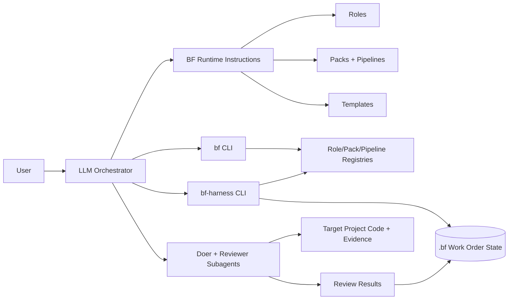
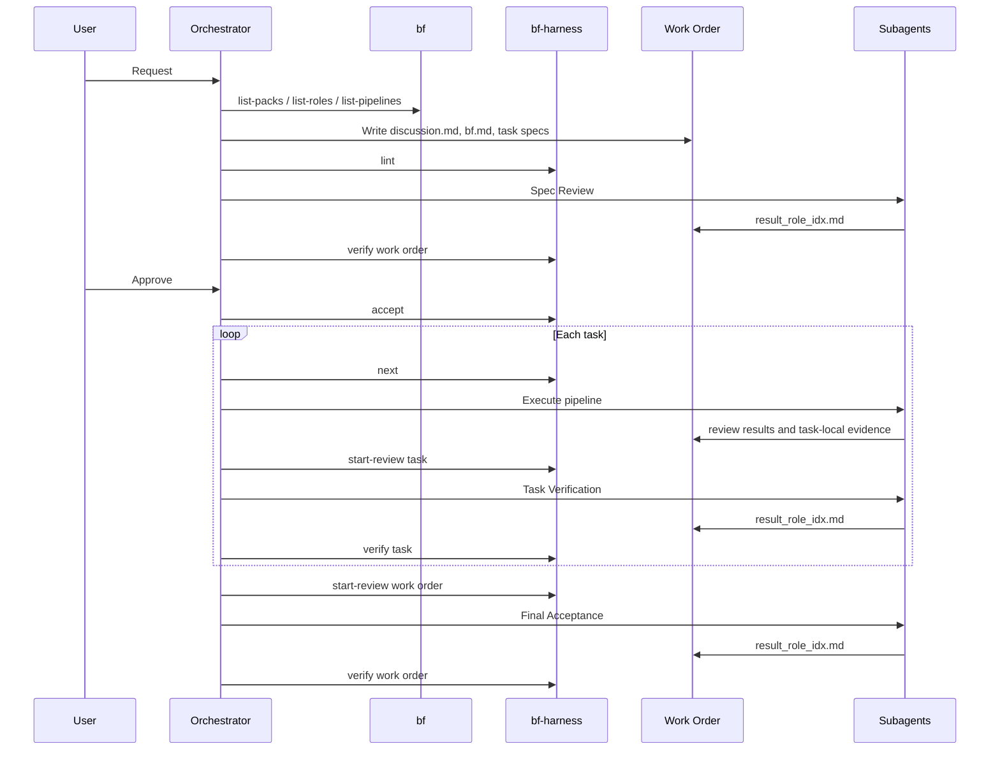

# BF Architecture

BF is a Markdown-first workflow runtime for LLM orchestrators. It combines
runtime instructions, durable Markdown contracts, and a small Node.js harness so
an LLM can plan, execute, review, and verify work without owning state mutation
directly.

## Boundary

BF owns:

- runtime instructions for the orchestrating LLM;
- role, pack, pipeline, and template definitions;
- work-order state under `<project-root>/.bf/<bf-wo>/`;
- mechanical lint, state transition, and review verification commands.

BF does not own:

- the target project's application runtime;
- the user's git workflow beyond BF-generated evidence and review needs;
- subagent identity enforcement inside the harness;
- domain-specific implementation choices inside a task.

## Architecture Map

## Modules

| Module | Role | Authority |
|---|---|---|
| Runtime instructions | Tell the orchestrator how to run BF phases. | Instruction authority only; no state mutation. |
| Templates | Define durable Markdown file shapes. | File contract authority. |
| Roles | Declare review and execution capabilities. | Capability registry authority. |
| Packs | Define domain guidance and available pipelines. | Domain workflow authority. |
| `bf` CLI | Lists roles, packs, pipelines, and manages host discovery snapshots. | Read-only metadata authority. |
| `bf-harness` CLI | Lints, accepts, claims tasks, starts reviews, verifies sign-off, and mutates allowed state. | State transition authority. |
| Work order state | Stores contracts, discussion, review rounds, verify results, and task state. | Durable workflow state. |

## State Authority

The LLM writes content during brainstorm and spec drafting. After `accept`, the
harness owns all contract state mutation:

- AC checkbox flips;
- `State:` transitions;
- `Updated:` synchronization.

The LLM continues to write non-locked artifacts:

- `discussion.md` append entries;
- implementation changes;
- evidence artifacts;
- review result files written by reviewer subagents.

This split keeps human-readable contracts editable during design while making
execution progress mechanically auditable after acceptance.

## Core Flow

## Verification Boundary

Review sign-off is content written by reviewer subagents. Verification is the
mechanical harness step that reads review results and decides whether the
contract can advance.

The harness verifies:

- review result shape;
- presence of Blocker or High findings;
- AC ids referenced by reviewers;
- capability-to-role sign-off;
- allowed checkbox and state transitions.

The orchestrator verifies:

- doer and reviewer are different subagent instances;
- reviewers receive the correct scope and evidence;
- fixes are dispatched after failed review;
- user approval happens before `accept`.

## Extension Boundary

Packs and roles are extension points. Core definitions live in the npm package.
Global user extensions live under `~/.bf/extensions/`. Project extensions live
under `<project-root>/.bf/extensions/`. Host discovery snapshots under
`~/.claude/skills/bf/` and `~/.agents/skills/bf/` are generated copies and are
not extension roots.

Effective registries are built before lint, listing, next, and verify
operations.

Pipeline definitions are currently instruction-level. The orchestrator reads the
pipeline and executes stages in order. Stage state and gate enforcement can move
into the harness later without changing the work-order contract model.

## Design Drill-Downs

- [Spec overview](spec.md)
- [Runtime layout and workflow](spec/runtime-layout-and-workflow.md)
- [Core constraints](spec/core-constraints.md)
- [File contracts](spec/file-contracts.md)
- [CLI and harness](spec/cli-and-harness.md)
- [Packs and pipelines](spec/packs-and-pipelines.md)
