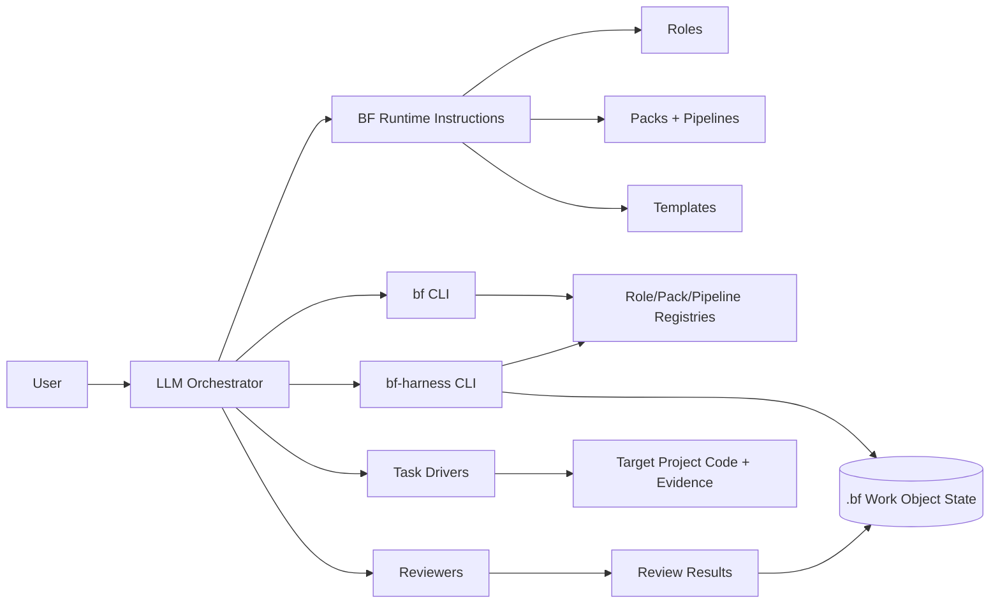
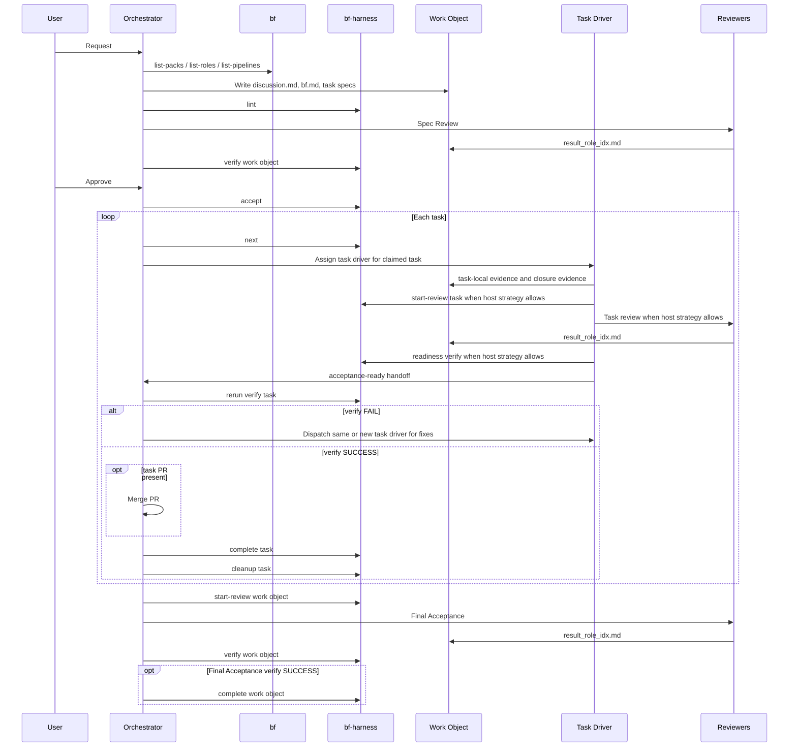

# BF Architecture

BF is a Markdown-first workflow runtime for LLM orchestrators. It combines
runtime instructions, durable Markdown contracts, and a small Node.js harness so
an LLM can plan, execute, review, and verify work without owning state mutation
directly.

## Boundary

BF owns:

- runtime instructions for the orchestrating LLM;
- role, pack, pipeline, and template definitions;
- work-object state under the resolved BF state home;
- mechanical lint, state transition, and review verification commands.

BF does not own:

- the target project's application runtime;
- the user's git workflow beyond BF-generated evidence and review needs;
- host actor identity enforcement inside the harness;
- domain-specific implementation choices inside a task.

## Architecture Map

## Modules

| Module | Role | Authority |
|---|---|---|
| Runtime instructions | Tell the orchestrator how to run BF phases. | Instruction authority only; no state mutation. |
| Templates | Define durable Markdown file shapes. | File contract authority. |
| Roles | Declare review and execution capabilities, including the Core security role for `security-review` and the Core interaction designer role for `interaction-design`. | Capability registry authority. |
| Packs | Define domain guidance and available pipelines. | Domain workflow authority. |
| `bf` CLI | Lists roles, packs, pipelines, manages host discovery snapshots, and updates the global BF npm package. | Read-only metadata and install-management authority. |
| `bf-harness` CLI | Lints, accepts, claims tasks, starts reviews, verifies sign-off, completes terminal transitions, and mutates allowed state. | State transition authority. |
| Work object state | Stores contracts, discussion, review rounds, verify results, and task state. | Durable workflow state. |

## State Authority

The LLM writes content during brainstorm and spec drafting. After `accept`, the
harness owns all contract state mutation:

- AC checkbox flips;
- `State:` transitions;
- `Updated:` synchronization;
- task execution metadata.

The LLM continues to write non-locked artifacts:

- `discussion.md` append entries;
- implementation changes;
- evidence artifacts;
- review result files written by reviewers.

This split keeps human-readable contracts editable during design while making
execution progress mechanically auditable after acceptance.

## Role Registry And References

Core roles are direct Markdown files under `roles/`. The role registry parses those direct files and maps each declared capability to provider roles. The Core `interaction-designer` role declares `interaction-design` for UI interaction design and review work.

Role reference files under `roles/references/` are runtime guidance that role instructions can ask actors to load for a reviewed scope. They are not role declarations, do not provide capabilities, and do not appear in `bf list-roles`; the registry boundary remains direct role files only.

## Core Flow

When the host runtime cannot delegate task review or readiness verification, the
coordinator performs those steps before the final task verify rerun.

## Verification Boundary

Review sign-off is content written by reviewers. Verification is the mechanical
harness step that reads independent review results, evaluates AC sign-off, flips
accepted AC checkboxes, and writes `verify-result.md`.

The harness verifies:

- review result shape;
- presence of Blocker or High findings;
- AC ids referenced by reviewers;
- capability-to-role sign-off;
- allowed AC checkbox flips.

The harness completes terminal state transitions separately. `complete` advances
task or work-object state after successful verification and required gates, such
as a merged same-repository PR for GitHub worktree tasks.

The orchestrator verifies:

- every claimed task and verification fix is assigned to a host-compatible task
  driver;
- the actor whose work is reviewed and the reviewer are different actor instances;
- reviewers receive the correct scope and evidence;
- fixes are dispatched after failed review;
- user approval happens before `accept`.

The main execute session coordinates. It runs harness commands, routes claimed
tasks, dispatches task drivers and reviewers, reads outputs, and stops on
ambiguity or blocked setup. It does not perform claimed task leaf work itself.
The harness does not track actor identity, enforce task-driver delegation, or
add a task-driver identity artifact.

## Extension Boundary

Packs and roles are extension points. Core definitions live in the npm package.
Global user extensions live under `~/.bf/extensions/`. Project extensions live
under the project BF state home at `extensions/`; in normal Git work this is the
primary worktree `.bf/extensions/`, linked worktrees included. Host discovery
snapshots under `~/.claude/skills/bf/`, `$CODEX_HOME/skills/bf/`, and
`~/.copilot/skills/bf/` are generated copies and are not extension roots. When
`CODEX_HOME` is unset, Codex defaults to `~/.codex/skills/bf/`. Copilot
auto-discovery uses `~/.copilot` or an existing `~/.copilot/skills/bf/`; it does
not use project-local `.github/skills/bf`, generic `.agents/skills/bf`, or
GitHub CLI skill preview commands. Each snapshot carries `.bf-install.json` so
`bf install` can report whether the snapshot was newly installed, refreshed,
updated, or updated from an unknown older copy. `bf update` upgrades the global
BF npm package with `npm install -g @codetreker/bf@latest`; snapshot refresh
remains the updated package's `postinstall` responsibility through `bf install`.

Same-id extension packs merge with Core packs. Pack guidance remains
LLM-readable through ordered `pack.md` paths; roles and pipelines merge
mechanically. Effective registries are built before lint, listing, next, and
verify operations.

Pipeline definitions are currently instruction-level. The orchestrator reads the
pipeline and executes stages in order. Stage state and gate enforcement can move
into the harness later without changing the work-object contract model.

## Repository Maintenance Boundary

Blueprintflow repository maintenance is governed by `AGENTS.md`, the root BF
runtime, and accepted docs. It is not a repo-maintenance skill or pack.
Repository changes still use the BF gate, normal validation, release metadata,
and PR evidence required by `AGENTS.md`.

Repository validation that can invoke BF install or test code runs with isolated
state: temporary `HOME`, `CODEX_HOME`, and `BF_HOME`. This prevents dependency
install hooks, host discovery snapshots, and BF work-object state from mutating
the user's real Claude, Codex, or BF directories. Ordinary CI and the manual
publish preflight both run dependency installation and the full npm test gate
under that isolation; publish then adds npm version/tag freshness checks and the
actual npm publish/tag steps.

Default maintenance authority follows the root BF package and accepted docs.
The deprecated `plugins/blueprintflow/` tree is an explicit exception path:
maintenance work reads or edits it only when the user requests legacy plugin
work. Legacy plugin validation and manifest version gates apply only to that
exception path.

## Design Drill-Downs

- [Spec overview](spec.md)
- [Runtime layout and workflow](spec/runtime-layout-and-workflow.md)
- [Core constraints](spec/core-constraints.md)
- [File contracts](spec/file-contracts.md)
- [CLI and harness](spec/cli-and-harness.md)
- [Packs and pipelines](spec/packs-and-pipelines.md)
