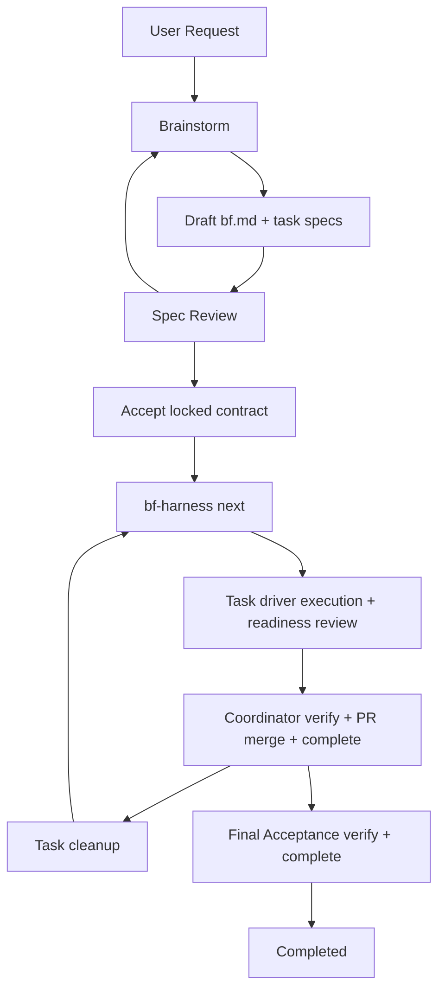

# BF Design Spec

`docs/spec.md` is the entrypoint for the current BF design record. It points
to focused subdocuments instead of carrying the full spec inline.

## System Boundary

BF is the npm package `@codetreker/bf`. It provides:

- runtime instructions for LLM orchestrators;
- roles, packs, templates, and phase references;
- `bf` metadata and install-management commands;
- `bf-harness` state and verification commands.

The runtime source lives at the repository root. Runtime artifacts must be
self-contained and must not depend on this `docs/` design record. Shipped
runtime templates under `templates/` are English-language file shapes; their
prose, placeholders, and comments are part of the runtime surface while their
frontmatter keys, section headings, and parser-facing markers remain stable
contracts.

BF interactions require a concise decision brief before material user decision
gates. The brief names the decision, relevant context and current evidence,
realistic options, tradeoffs or consequences, and a recommendation when evidence
supports one. Simple factual clarifications, status updates, and obvious
yes/no confirmations may remain lightweight when the immediate context is
clear. Runtime artifacts carry this rule directly; they do not rely on this
design record for executable guidance.

## Project Design Authority

For work inside a target project, BF treats confirmed project design docs as the
external system design authority. BF discovers the project design-doc root from
project instructions, repository structure, prompts, workflows, and document
content instead of assuming a fixed path. Once confirmed, those docs are the
project system design single source of truth for boundaries, ownership, state,
cross-module flows, validation boundaries, known gaps, and stable implementation
anchors.

BF records doc-root discovery in the work object's `discussion.md` and reuses a
confirmed recorded root across phases. If an inferred root is confirmed by the
user, BF asks whether to persist that root in the governing project instruction
file, records the answer, and routes any instruction-file mutation through the
accepted BF contract or an explicit out-of-band user command. If code and
confirmed design docs disagree, BF records design drift and stops for
clarification instead of choosing whether code or docs win.

BF does not define `.tasks/` as a runtime or draft-work directory. Draft
discussion, contracts, task specs, review results, and execution artifacts are
BF work-object state under `.bf/works/<bf-wo>/` in normal project work;
project-specific draft locations only exist when that project separately
defines them.

BF requires discussion.md source coverage before `bf.md` authoring. The
recorded discussion must contain source material for the future Goal,
Requirement, Acceptance Criteria, Boundary, and Task List rationale. `bf.md`
stays concise: it distills the recorded discussion into a contract without
quoting or citing `discussion.md` by default.

New BF work starts by bootstrapping `<state-home>/works/<bf-wo>/`: choose a
readable id, create the directory, copy `templates/discussion.md`, and append
the first accepted discussion entry before task breakdown. Read-only BF
requests such as explanation, audit, status, or advisory discussion do not
create or mutate a work object unless the user asks to turn them into
implementation work.

During execute, the main session is the coordinator. It runs harness commands,
routes claimed tasks, dispatches task drivers and reviewers, reads outputs,
coordinates PR merge, runs `complete`, runs cleanup, and stops on ambiguity or
blocked setup. Every claimed task and verification fix is assigned to a
host-compatible task driver; in Codex, that actor is a Codex subagent. The task
driver executes the task pipeline and may run task review plus readiness verify
when the host-runtime strategy allows. Reviewers remain different actor
instances from the actor whose work they review.

Harness signoff is provider-role based: for Task Verification and Final
Acceptance, an AC is signed when at least one provider role accepts the AC id in
a clean review round. `verify` proves acceptance or signoff and flips ACs, but
it does not move tasks or bf.md to `Completed`. The coordinator reruns task
verify, merges any recorded PR, runs `complete` to mark the task `Completed`,
and then runs task cleanup. Final Acceptance follows the same boundary:
bf-level `verify` signs ACs, and bf-level `complete` marks the work object
`Completed`.

## Reading Map

| Need | Start Here |
|---|---|
| Overall architecture | [Architecture](architecture.md) |
| Runtime and work item layout | [Runtime layout and workflow](spec/runtime-layout-and-workflow.md) |
| Independent Verification, state, and locked mutations | [Core constraints](spec/core-constraints.md) |
| Durable file contracts | [File contracts](spec/file-contracts.md) |
| CLI and harness command behavior | [CLI and harness](spec/cli-and-harness.md) |
| Pack, role, and pipeline model | [Packs and pipelines](spec/packs-and-pipelines.md) |
| User-requested GitHub issue feedback | [Feedback mechanism](spec/feedback.md) |

## Module Summary

| Module | Role | Durable Interfaces |
|---|---|---|
| Runtime docs | Tell the orchestrating LLM how to run BF | `SKILL.md`, `references/`, `packs/`, `roles/`, `roles/references/`, `templates/` |
| Project design docs | Discovered external design authority for target-project work | Confirmed project doc root, recorded in `.bf/works/<bf-wo>/discussion.md`; runtime anchor `references/project-docs.md` |
| Repository maintenance authority | Blueprintflow maintenance rules | `AGENTS.md`, root BF runtime, accepted docs, validation scripts, and PR gate evidence |
| `bf` CLI | Read-only metadata and install management | `list-packs`, `list-pipelines`, `list-roles`, `install`, `update`, `uninstall`, `version` |
| `bf-harness` CLI | Work-object state, verification, and lifecycle loop | `list`, `status`, `lint`, `start-review`, `accept`, `next`, `attach-pr`, `verify`, `complete`, `cleanup`, `discard` |
| Work object state | Per-project BF work state | Git default `<primary-worktree>/.bf/works/<bf-wo>/`; non-Git default `<cwd>/.bf/works/<bf-wo>/` |
| Extension registry | User and project roles/packs | `~/.bf/extensions`, `<state-home>/extensions` |

## Implementation Anchors

- Runtime entry: [`SKILL.md`](../SKILL.md)
- CLIs: [`bin/bf.mjs`](../bin/bf.mjs), [`bin/bf-harness.mjs`](../bin/bf-harness.mjs)
- Harness internals: [`bin/lib/harness/`](../bin/lib/harness/)
- Shared registries/parsers: [`bin/lib/shared/`](../bin/lib/shared/)
- Core roles and role references: [`roles/`](../roles/)
- Core packs: [`packs/`](../packs/)
- File templates: [`templates/`](../templates/)
- Runtime phase references: [`references/`](../references/)
