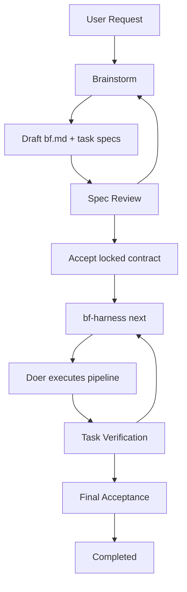

# BF Design Spec

`docs/spec.md` is the entrypoint for the current BF design record. It points
to focused subdocuments instead of carrying the full spec inline.

## System Boundary

BF is the npm package `@codetreker/bf`. It provides:

- runtime instructions for LLM orchestrators;
- roles, packs, templates, and phase references;
- `bf` metadata commands;
- `bf-harness` state and verification commands.

The runtime source lives at the repository root. Runtime artifacts must be
self-contained and must not depend on this `docs/` design record.

## Project Design Authority

For work inside a target project, BF treats confirmed project design docs as the
external system design authority. BF discovers the project design-doc root from
project instructions, repository structure, prompts, workflows, and document
content instead of assuming a fixed path. Once confirmed, those docs are the
project system design single source of truth for boundaries, ownership, state,
cross-module flows, validation boundaries, known gaps, and stable implementation
anchors.

BF records doc-root discovery in the work object's `discussion.md` and reuses a
confirmed recorded root across phases. If an inferred root is confirmed by the
user, BF asks whether to persist that root in the governing project instruction
file, records the answer, and routes any instruction-file mutation through the
accepted BF contract or an explicit out-of-band user command. If code and
confirmed design docs disagree, BF records design drift and stops for
clarification instead of choosing whether code or docs win.

BF does not define `.tasks/` as a runtime or draft-work directory. Draft
discussion, contracts, task specs, review results, and execution artifacts are
BF work-object state under `.bf/<bf-wo>/`; project-specific draft locations only
exist when that project separately defines them.

## Reading Map

| Need | Start Here |
|---|---|
| Overall architecture | [Architecture](architecture.md) |
| Runtime and work item layout | [Runtime layout and workflow](spec/runtime-layout-and-workflow.md) |
| Independent Verification, state, and locked mutations | [Core constraints](spec/core-constraints.md) |
| Durable file contracts | [File contracts](spec/file-contracts.md) |
| CLI and harness command behavior | [CLI and harness](spec/cli-and-harness.md) |
| Pack, role, and pipeline model | [Packs and pipelines](spec/packs-and-pipelines.md) |
| User-requested GitHub issue feedback | [Feedback mechanism](spec/feedback.md) |

## Module Summary

| Module | Role | Durable Interfaces |
|---|---|---|
| Runtime docs | Tell the orchestrating LLM how to run BF | `SKILL.md`, `references/`, `packs/`, `roles/`, `templates/` |
| Project design docs | Discovered external design authority for target-project work | Confirmed project doc root, recorded in `.bf/<bf-wo>/discussion.md`; runtime anchor `references/project-docs.md` |
| `bf` CLI | Read-only metadata and install management | `list-packs`, `list-pipelines`, `list-roles`, `install`, `uninstall`, `version` |
| `bf-harness` CLI | State mutation and verification loop | `lint`, `start-review`, `accept`, `next`, `verify`, `discard`, `list` |
| Work object state | Per-project BF work state | `<project-root>/.bf/<bf-wo>/` |
| Extension registry | User and project roles/packs | `extensions/roles`, `extensions/packs` |

## Implementation Anchors

- Runtime entry: [`SKILL.md`](../SKILL.md)
- CLIs: [`bin/bf.mjs`](../bin/bf.mjs), [`bin/bf-harness.mjs`](../bin/bf-harness.mjs)
- Harness internals: [`bin/lib/harness/`](../bin/lib/harness/)
- Shared registries/parsers: [`bin/lib/shared/`](../bin/lib/shared/)
- Core roles: [`roles/`](../roles/)
- Core packs: [`packs/`](../packs/)
- File templates: [`templates/`](../templates/)
- Runtime phase references: [`references/`](../references/)
