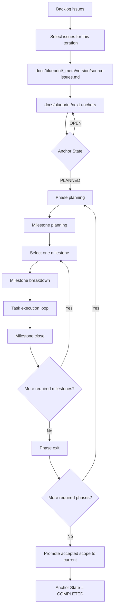

# Blueprintflow Iteration Flow

Blueprintflow turns selected backlog issues into accepted current behavior through a dependency-ordered path:

```text
GitHub backlog issues
-> source trace
-> next blueprint anchors
-> Phase planning
-> Milestone planning
-> selected milestone breakdown
-> task execution loop
-> milestone close
-> Phase exit
-> current promotion
```

## Flow Diagram



## State Ledger

`docs/blueprint/next/README.md` is the resume ledger for next-blueprint anchors.

Use this shape:

```markdown
| Anchor | Detail anchor | Topic | State | Milestone path |
|---|---|---|---|---|
| AUTH-1 | auth.md#auth-1 | Auth model | OPEN | - |
| AUTH-2 | auth.md#auth-2 | Login session | PLANNED | - |
| AUTH-3 | auth.md#auth-3 | Org role API | IMPLEMENTING | docs/tasks/phase-1-auth/milestone-2-role-api |
| AUTH-4 | auth.md#auth-4 | Invite flow | COMPLETED | docs/tasks/phase-1-auth/milestone-3-invite |
```

| State | Meaning | Next route |
|---|---|---|
| `OPEN` | Product scope is still being discussed. | Continue blueprint discussion. |
| `PLANNED` | Product scope is selected and ready for execution planning. | Run Phase/Milestone planning. |
| `IMPLEMENTING` | The anchor is active in `docs/tasks`. | Resume from `docs/tasks/README.md` and `milestone.md`. |
| `COMPLETED` | Accepted scope is ready for current promotion or already reflected in current. | Promote or confirm current sync. |

`_meta` stores source trace only. Runtime routing comes from `docs/blueprint/next/README.md` and `docs/tasks` state files.

## Completion Rules

Each stage starts after the previous stage has its required state or fields. Use field values and required files to decide readiness.

| Stage | Completion rule |
|---|---|
| Backlog selection | `docs/blueprint/_meta/<version>/source-issues.md` exists and maps selected issues to next anchors. |
| Next blueprint anchors | `docs/blueprint/next/README.md` has `Anchor`, `Detail anchor`, `Topic`, `State`, and `Milestone path`; each detail anchor points to a concrete `docs/blueprint/next/*.md` section. |
| Anchor planning | Selected anchor `State` is `PLANNED`. |
| Phase planning | `docs/tasks/README.md` has a Phase row; `docs/tasks/phase-N-*/phase-plan.md` exists; the Phase has a value loop, dependency order, and exit gate. |
| Milestone planning | `phase-plan.md` lists milestones; each planned milestone has `milestone.md`; `milestone.md` has goal, acceptance boundary, dependencies, and breakdown trigger or task-split policy. |
| Milestone selection | One milestone is selected for execution; dependencies are satisfied; `milestone.md` is ready as breakdown input. |
| Milestone breakdown | The selected milestone only is broken down; `milestone.md` lists reviewed tasks; each task folder has `task.md`; task dependencies are recorded; at least one unblocked first task is `READY`. |
| Task execution | Each task follows one worktree, one branch, one PR; four-piece, design, implementation, verification, review, and merge are complete. |
| Milestone close | Required milestone tasks are accepted; milestone acceptance and gates pass. |
| Phase exit | Required milestones in the Phase are complete; Phase exit gates pass; carried work has a follow-up anchor or task. |
| Current promotion | Accepted behavior is reflected in `docs/blueprint/current/`; corresponding next anchors are `COMPLETED`. |

## Planning Rules

- Phase is a dependency-ordered stage inside one major iteration. Default to no more than 3 Phases.
- Milestone is a user-facing deliverable inside a Phase. Default to no more than 3 Milestones per Phase.
- Task is the execution and PR atom. One task uses one worktree, one branch, and one PR.
- Milestone breakdown runs for one selected milestone at a time.
- Parallel work is valid inside a stage when dependencies are clear and the owning plan records the safe parallelism.
