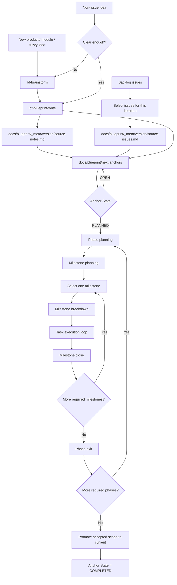

# Blueprintflow Iteration Flow

Blueprintflow turns selected sources into accepted current behavior through a dependency-ordered path:

```text
source intake
-> source trace
-> next blueprint anchors
-> Phase planning
-> Milestone planning
-> selected milestone breakdown
-> task execution loop
-> milestone close
-> Phase exit
-> current promotion
```

## Flow Diagram



## Source Intake

| Source | Route | Trace artifact |
|---|---|---|
| New product, new module, or fuzzy idea | Run `bf-brainstorm`, then `bf-blueprint-write`. | `docs/blueprint/_meta/<version>/source-notes.md` |
| Backlog GitHub issues | Select this iteration's issues. | `docs/blueprint/_meta/<version>/source-issues.md` |
| Non-issue idea in an existing product | Run `bf-brainstorm` when unclear; otherwise run `bf-blueprint-write`. | `docs/blueprint/_meta/<version>/source-notes.md` |

`source-issues.md` maps issue-backed sources to next anchors. `source-notes.md` maps non-issue sources to next anchors. Both are source trace only.

## State Ledger

`docs/blueprint/next/README.md` is the resume ledger for next-blueprint anchors.

Use this shape:

```markdown
| Anchor | Detail anchor | Topic | State | Milestone path |
|---|---|---|---|---|
| AUTH-1 | auth.md#auth-1 | Auth model | OPEN | - |
| AUTH-2 | auth.md#auth-2 | Login session | PLANNED | - |
| AUTH-3 | auth.md#auth-3 | Org role API | IMPLEMENTING | docs/tasks/phase-1-auth/milestone-2-role-api |
| AUTH-4 | auth.md#auth-4 | Invite flow | COMPLETED | docs/tasks/phase-1-auth/milestone-3-invite |
```

| State | Meaning | Next route |
|---|---|---|
| `OPEN` | Product scope is still being discussed. | Continue blueprint discussion. |
| `PLANNED` | Product scope is selected and ready for execution planning. | Run Phase/Milestone planning. |
| `IMPLEMENTING` | The anchor is active in `docs/tasks`. | Resume from `docs/tasks/README.md` and `milestone.md`. |
| `COMPLETED` | Accepted scope is ready for current promotion or already reflected in current. | Promote or confirm current sync. |

`_meta` stores source trace only. Runtime routing comes from `docs/blueprint/next/README.md` and `docs/tasks` state files.

## Completion Rules

Each stage starts after the previous stage reaches the required state. Read state values from the relevant row or batch, not from logs or inferred file presence.

| Stage | State check |
|---|---|
| Source intake | Source batch `State = SELECTED`. |
| Next blueprint anchors | Each selected source maps to one or more anchor rows; each anchor row has `State = OPEN` or `State = PLANNED`. |
| Anchor planning | Each anchor selected for execution has `State = PLANNED`. |
| Phase planning | Each planned Phase row has `State = PLANNED`. |
| Milestone planning | Each Milestone row under the target Phase has `State = PLANNED`. |
| Milestone selection | One dependency-ready Milestone row has `State = SELECTED`. |
| Milestone breakdown | The selected Milestone row has `State = TASK_SET_READY`. |
| Task execution | Each executed Task row reaches `State = ACCEPTED`. |
| Milestone close | The target Milestone row has `State = ACCEPTED`. |
| Phase exit | The target Phase row has `State = ACCEPTED`. |
| Current promotion | Corresponding next anchor rows have `State = COMPLETED`. |

State belongs to object rows: source batch, anchor, Phase, Milestone, and Task. A stage is done when the relevant row set reaches the required state.

## Planning Rules

- Phase is a dependency-ordered stage inside one major iteration. Default to no more than 3 Phases.
- Milestone is a user-facing deliverable inside a Phase. Default to no more than 3 Milestones per Phase.
- Task is the execution and PR atom. One task uses one worktree, one branch, and one PR.
- Milestone breakdown runs for one selected milestone at a time.
- Parallel work is valid inside a stage when dependencies are clear and the owning plan records the safe parallelism.
