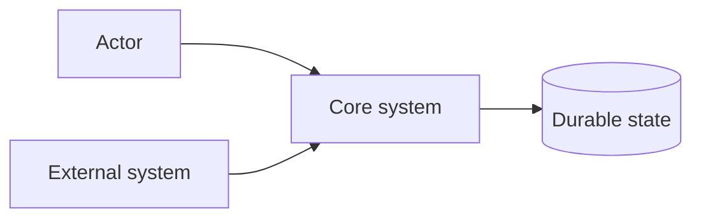
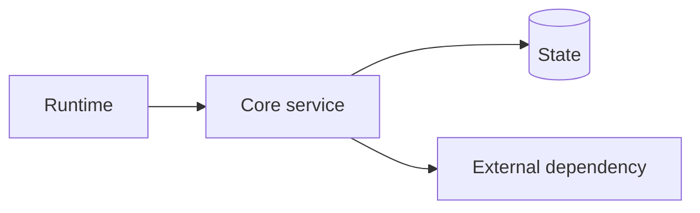

# docs/current Template

Use this only when a project has no `docs/current` yet. Keep files short; delete sections that do not apply.

## Initial File Tree

```text
docs/current/
├── README.md
├── system-overview.md
├── runtime-topology.md
├── cross-module-flows.md
├── known-gaps.md
└── <module>/
    └── README.md
```

Add focused subdocs only when the module needs them: `data-model.md`, `security.md`, `ui-map.md`, `verification.md`.

## README.md

````markdown
# Current Architecture

<One sentence: what the implemented system is and its central authority/boundary.>



## Module Architecture Summary

| Module | Role | Boundary | Primary Interfaces |
|---|---|---|---|
| `<module>` | <responsibility> | <what it does not own> | <API/event/file/protocol> |

## Architecture Reading Map

| Need | Start here | Then drill into |
|---|---|---|
| System shape | [System overview](system-overview.md) | [Runtime topology](runtime-topology.md) |
| Cross-module behavior | [Cross-module flows](cross-module-flows.md) | `<module>/` |
| Current gaps | [Known gaps](known-gaps.md) | module-local gap notes |

## Implementation Anchors

- Core entry: `<path/to/entry>`
- Main module: `<path/to/module>`
- Durable schema/config: `<path/to/schema-or-config>`
````

## system-overview.md

````markdown
# System Overview

<System definition in current-tense. Say what owns durable truth and policy.>

## Boundaries

| Boundary | What Crosses It | Why It Exists |
|---|---|---|
| <A to B> | <requests/events/data> | <authority/isolation reason> |

## Design Principles

- <Current invariant or architectural rule.>
- <State ownership rule.>

## Out Of Scope

- <Adjacent system or future intent not described here.>

## Next Drill-Downs

| Need | Link |
|---|---|
| Runtime/process view | [Runtime topology](runtime-topology.md) |
| Cross-boundary flows | [Cross-module flows](cross-module-flows.md) |

## Implementation Anchors

- `<stable/path>`
````

## runtime-topology.md

````markdown
# Runtime Topology

<Process/runtime view of the implemented system. Name product runtimes separately from verification/support tooling.>



## Runtime Roles

| Runtime | Role | Collaborators | Non-Goal |
|---|---|---|---|
| <runtime> | <what it does> | <what it talks to> | <what it does not own> |

## Startup And Ownership

<Current startup/composition path and which runtime owns which state or policy.>

## Next Drill-Downs

| Need | Link |
|---|---|
| Boundary flows | [Cross-module flows](cross-module-flows.md) |
| Module internals | [`<module>/`](<module>/) |

## Implementation Anchors

- `<stable/path>`
````

## cross-module-flows.md

````markdown
# Cross-Module Flows

This page follows high-impact behavior across boundaries. It is not a handler catalog.

## Flow Index

| Flow | Boundary | Owner docs |
|---|---|---|
| <user action/event> | <modules crossed> | [`<module>`](<module>/) |

## <Flow Name>

```mermaid
sequenceDiagram
  participant Actor
  participant ModuleA
  participant ModuleB
  Actor->>ModuleA: trigger
  ModuleA->>ModuleB: permission/state request
  ModuleB-->>Actor: observable result
```

Current behavior: <what happens now, including state reads/writes and side effects.>

Authority: <which module is source of truth and which state is derived/cache/runtime-only.>

## Implementation Anchors

- `<stable/path>`
````

## <module>/README.md

````markdown
# <Module>

## Role

<What this module owns in the implemented system.>

## Boundary

<What enters/exits; what the module explicitly does not own.>

## Collaborators

| Collaborator | Relationship |
|---|---|
| <module/service> | <why it is called or depended on> |

## Internal Architecture

<Short current-tense description of internal layers or components.>

## Key Flows

- <Trigger → module path → state change/side effect → observable result.>

## Invariants

- <Rule that must stay true across changes.>

## Subdocuments

- [data-model.md](data-model.md): <why to read it>
- [security.md](security.md): <why to read it>

## Implementation Anchors

- `<stable/path>`
````

## known-gaps.md

````markdown
# Known Gaps

## <Gap Name>

Current behavior: <what the system does today.>

Architecture impact: <why this matters for readers or maintainers.>

Do not assume: <wrong assumption readers must avoid.>

Relevant area: <doc link or module owner.>

## Implementation Anchors

- `<stable/path>`
````
