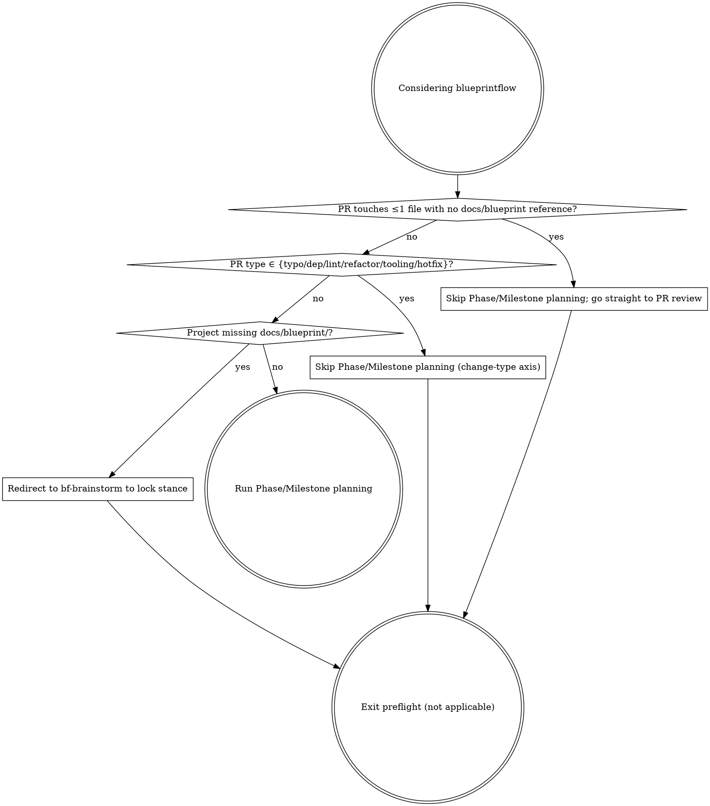

# Preflight check

Before using the bf-phase-plan flow, walk this decision graph. If any check returns "yes", skip the heavyweight machinery.

## Decision points

After this preflight says Phase/Milestone planning applies, require recorded `bf-blueprint-iteration` Next lock integrity gate evidence in `docs/blueprint/_meta/<target-version>/next-lock-integrity.md`. Treat evidence as stale if selected anchors, README rows, detail anchors, blockers/open anchors, source issue/note trace, milestone paths, `phase-plan.md`, or `milestone.md` changed after the recorded gate result. If the gate is missing, stale, or failed, stop and return to `bf-blueprint-iteration` for fresh lock evidence before planning.

| # | Check | Skip if | Constraint |
|---|---|---|---|
| 1 | `git diff --name-only main \| wc -l` ≤ 1 and no `docs/blueprint` reference | Single-file fix, no blueprint citation | If the change cites §X.Y → route through `bf-workflow` |
| 2 | PR type is typo / dep bump / lint / refactor / tooling / hotfix | Mechanical change | Breaking dep bump → fall back; hotfix must have retro PR by the project-defined hotfix threshold |
| 3 | `docs/blueprint/` missing or only README | No blueprint yet | Redirect to `bf-brainstorm` + `bf-blueprint-write` first |

Walk the checks **in order** — each depends on the earlier ones.

## Anti-patterns

- ❌ Skipping preflight → heavyweight machinery on a project that doesn't need it
- ❌ Forcing phase-plan after preflight said "not applicable"
- ❌ Short-circuiting the checks with "or" (they run in series)
- ❌ Permanent hotfix bypass without retro PR by the project-defined hotfix threshold
- ❌ Using small human team size to skip required role or Security review
