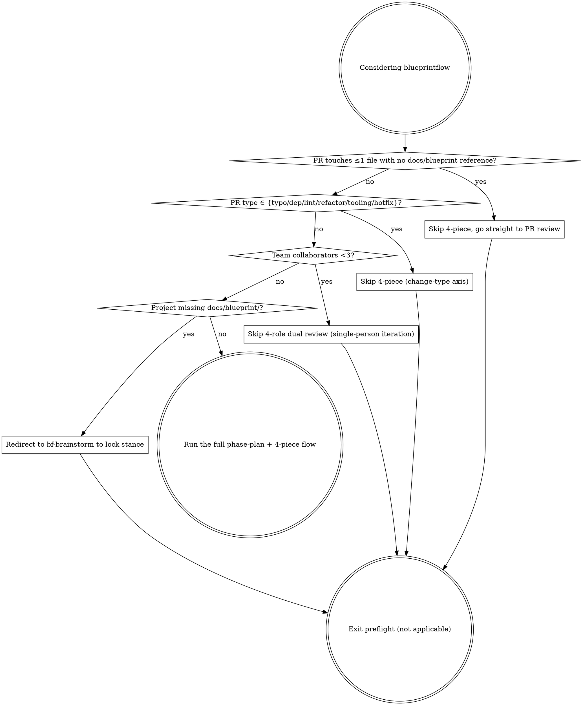

# Preflight check

Before using the bf-phase-plan flow, walk this decision graph. If any check returns "yes", skip the heavyweight machinery.

## Decision points

| # | Check | Skip if | Constraint |
|---|---|---|---|
| 1 | `git diff --name-only main \| wc -l` ≤ 1 and no `docs/blueprint` reference | Single-file fix, no blueprint citation | If the change cites §X.Y → can't skip, run 4-piece |
| 2 | PR type is typo / dep bump / lint / refactor / tooling / hotfix | Mechanical change | Breaking dep bump → fall back; hotfix must have retro PR within 7 days |
| 3 | `gh api repos/:o/:r/contributors \| jq length` < 3 | Solo / 2-person team | AI agent team (1 human + 6 agents) = full team, not solo |
| 4 | `docs/blueprint/` missing or only README | No blueprint yet | Redirect to `bf-brainstorm` + `bf-blueprint-write` first |

Walk the checks **in order** — each depends on the earlier ones.

## Anti-patterns

- ❌ Skipping preflight → heavyweight machinery on a project that doesn't need it
- ❌ Forcing phase-plan after preflight said "not applicable"
- ❌ Short-circuiting the 4 checks with "or" (they run in series)
- ❌ Permanent hotfix bypass without retro PR within 7 days
