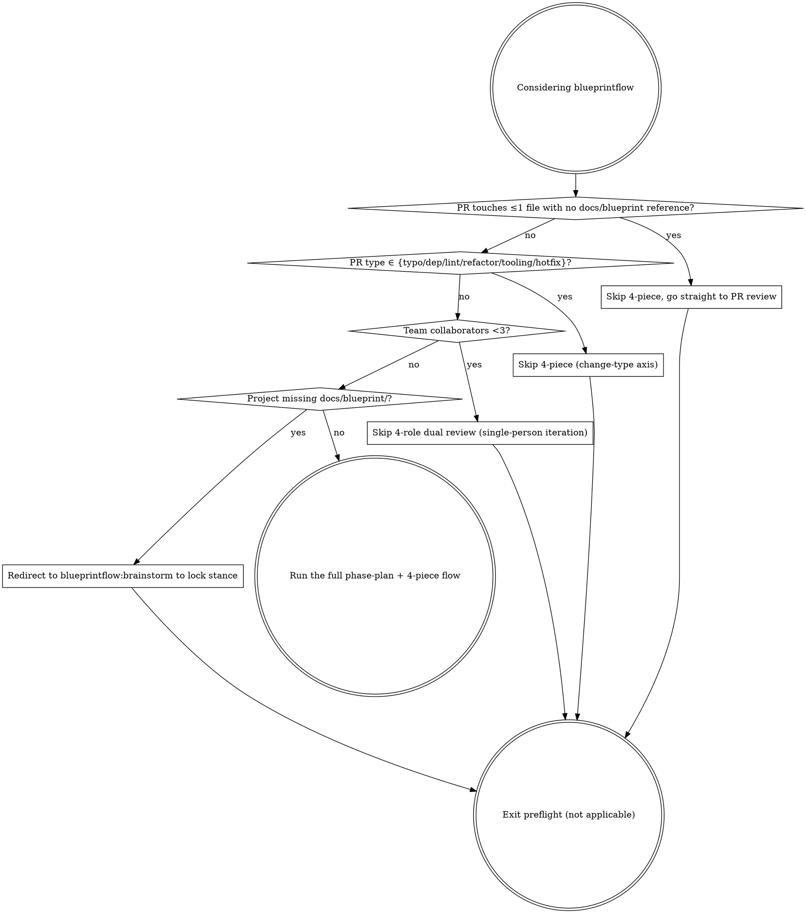

# Phase Plan

Once the blueprint is ready, the Architect leads. Break the project into a sequence of Phases, each anchored to a **value loop** (something an end user can actually use), not to technical layers.

## Preflight check

Before you reach for this heavyweight machinery, run the decision graph to check whether it actually applies. The 6 not-applicable scenarios split across two axes: a **task-size axis** (change volume / team / concept lock-in) and a **change-type axis** (typo / dep / lint / single-file refactor / tooling / hotfix). The two axes are complementary, and four diamond decision points run in series:



### The four decision points in detail

1. **Single PR touches ≤1 file with no `docs/blueprint/` reference** (task-size axis) → skip the 4-piece, go straight to PR review
   - Check: `git diff --name-only main | wc -l` ≤ 1 and `git diff main | grep -c 'docs/blueprint'` == 0
   - Reason: the 4-piece (spec / stance / acceptance / content-lock) is milestone-level overhead. A single-file fix or comment tweak doesn't need it. The single review path in `blueprintflow:pr-review-flow` is enough.
   - Constraint: if a single-file change cites a blueprint §X.Y (modifying a stance / changing a concept definition) → you can't skip; you have to run the 4-piece + 4-role review.

2. **PR type ∈ {typo / dep bump / lint patch / single-file refactor / CI tooling / hotfix}** (change-type axis) → skip the 4-piece
   - Check (skip if any one matches): typo (commit message contains `typo` / `fix typo`); dep bump (only `package.json` / `go.mod` / `Cargo.toml` + lockfile); lint patch (only `.eslintrc` / `.golangci.yml` / formatter config); single-file refactor (variable rename / extract function, no API or stance change); CI tooling (`.github/` / ruleset / cron tweaks); hotfix (`hotfix/` branch prefix + tied to a production incident).
   - Reason: these PRs are mechanical in shape (dep management / tooling / emergency fix); running spec → stance → acceptance → content-lock is empty motion. Hotfix also skips brainstorm (the emergency path can't wait for stance lock).
   - Constraint: ❌ a major-version dep bump (breaking) → fall back to the 4-piece (cross-version = changing the concept contract); ❌ a single-file refactor that crosses a blueprint §X.Y anchor → fall back; ❌ a hotfix must be followed within 7 days by a retro PR explaining the root cause (you can't permanently use hotfix to bypass).

3. **Team collaborators < 3** (task-size axis) → skip the 4-role dual review (single-person iteration scenario)
   - Check: actual active contributor count in the repo (`gh api repos/:owner/:repo/contributors | jq length`) < 3
   - Reason: the 4-piece + dual review path assumes PM / Dev / QA / Architect collaborating across multiple people. A 1- or 2-person project can't carry 4 roles; self-review is enough.
   - Constraint: an AI agent team (e.g. 1 human + 6 role agents) **doesn't count as single-person** — the agents fill the roles, run the full flow.

4. **Project is missing the `docs/blueprint/` directory** (task-size axis) → redirect to `blueprintflow:brainstorm` to lock stance, then come back
   - Check: `test -d docs/blueprint/ && ls docs/blueprint/*.md | wc -l` ≥ 1
   - Reason: phase-plan assumes "blueprint ready" (literally the first sentence of this skill). Splitting Phases without stances or a concept model = splitting an empty shell. Step back, run brainstorm + blueprint-write to lock stance, then come back.
   - Constraint: `docs/blueprint/` exists but only has a README and no concrete module docs → still counts as not-ready; run brainstorm to fill it (a lone README isn't a product-shape source of truth).

### Anti-patterns

- ❌ Skipping preflight and going straight into phase-plan: dragging heavyweight machinery onto a project that doesn't need it, slowing short-task iteration
- ❌ Forcing phase-plan after preflight returned "not applicable": once the decision graph says "not applicable", exit; don't double back
- ❌ Short-circuiting the four decision points with "or": you have to walk the graph in order (change volume → change type → team size → blueprint ready); each later condition depends on the earlier ones being confirmed
- ❌ Permanently bypassing the 4-piece via hotfix / dep bump: a retro PR is required within 7 days (consistent with constraint 2)

## How to split Phases

Split by **value loop**, not by technical layer:

- ❌ Wrong: Phase 1 schema / Phase 2 server / Phase 3 client (technical layers, no value)
- ✅ Right: Phase 1 identity loop / Phase 2 collaboration loop / Phase 3 second-dimension product / Phase 4+ remaining (each Phase independently demonstrable)

> **Real example (Borgee):**
> - Phase 0 foundation
> - Phase 1 identity loop — usable on signup
> - Phase 2 collaboration loop ⭐ — multi-person collaboration
> - Phase 3 second-dimension product
> - Phase 4+ remaining modules

## Exit gate design

Every Phase must have **machine-checkable** + **user-perceivable** exit conditions on dual rails:

### Strict gate (machine-checkable)
- e.g. cookie crosstalk reverse assertion / throttling unit test / lint passes

### User-perceivable gate (signoff)
- A flagship milestone runs a demo + PM signs off + key screenshot
- Cross-Phase you can't skip this (Phase 2 exit = a real human can use it + PM ✅)

### Carry-over gate (partial signoff allowed)
- Doesn't block Phase exit, but must be anchored to a Phase N+1 placeholder PR # (rule 6)
- e.g. a carry-over gate anchored to a placeholder PR # in the next Phase

## Four drift-prevention gates

Every milestone must have these four gates attached before execution:

1. **Gate 1 template self-check** (Architect): the spec brief uses the template; check it's general enough
2. **Gate 2 grep §X.Y anchor** (Architect): every milestone has a blueprint anchor
3. **Gate 3 reverse-check table** (PM + Architect): at the end of every module doc; if a stance can't be written in one sentence, drift is happening
4. **Gate 4 flagship milestone signoff + key screenshot** (PM; AI teams skip the video)

Gates 1+2 happen in the spec brief PR (`blueprintflow:milestone-fourpiece`), gate 3 in stance + acceptance, gate 4 at demo signoff (closed by `blueprintflow:phase-exit-gate`).

## Deliverables

**Path**: `docs/implementation/`

- **PROGRESS.md** — single source of progress truth, updated on every PR / Phase gate state change
- **00-foundation/execution-plan.md** — 5 Phases + exit gates + 4 drift gates
- **00-foundation/roadmap.md** — thumbnail + first-wave demo path
- **00-foundation/how-to-write-milestone.md** — milestone template + acceptance four-choice
- **modules/** — N module outlines, each milestone broken down to PR scale (≤500 lines)

## PROGRESS.md template

```
| Phase | Status | Exit condition | Notes |
|-------|--------|----------------|-------|
| Phase 0 foundation loop | ✅ DONE | G0.x all passed | bootstrap |
| Phase 1 identity loop | ✅ DONE | G1.x all passed | <milestone-ids> |
| Phase 2 collaboration loop ⭐ | 🔄/✅ | strict N + carry-over anchored to Phase 4 PR # | <milestone-id> ⭐ |
| Phase 3 second dimension | TODO | G3.x + PM signoff | waiting for Phase 2 |
| Phase 4+ remaining | TODO | G4.audit | waiting for Phase 3 |
```

After every PR is merged, update the corresponding milestone row ⚪→✅ immediately (via a follow-up flip PR, see `blueprintflow:pr-review-flow`).

## Anti-patterns

- ❌ Splitting Phases by technical layer (no value loop)
- ❌ Exit gates that only rely on machine checks (missing user perception)
- ❌ Carry-over gate not anchored to a Phase N+1 PR # (rule 6 requires it)
- ❌ PROGRESS.md not updated promptly (slow-cron audit will catch it and assign a fix-up)

## How to invoke

After the blueprint is ready:

```
follow skill blueprintflow-phase-plan
write PROGRESS.md + execution-plan + roadmap
```
