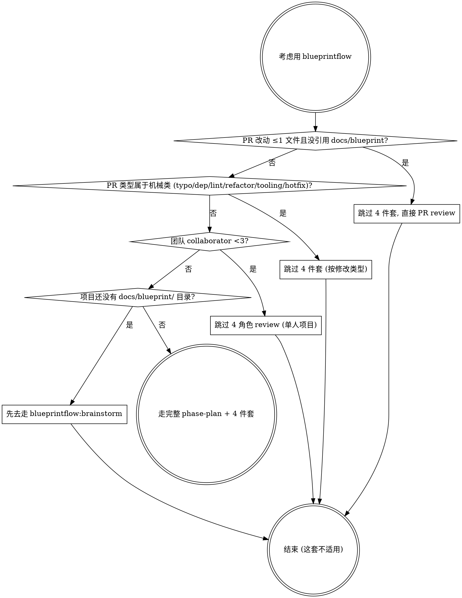

# Phase Plan

蓝图就绪后, Architect 主, 把项目拆成一连串 Phase. 每个 Phase 要做到一件**用户能用的事** (端到端的价值闭环), 不是按技术层拆.

## 用之前先判断要不要用

这是重型流程, 不是所有项目都该套. 先按下面 4 个问题判一下, 任何一个命中"是"就跳过这套, 走轻量路径:



### 4 个问题怎么判

**1. 单 PR 改动 ≤1 文件 且没引用 `docs/blueprint/`** → 跳过 4 件套, 直接走 PR review
- 怎么查: `git diff --name-only main | wc -l` ≤ 1 且 `git diff main | grep -c 'docs/blueprint'` == 0
- 为什么: 4 件套 (spec / stance / acceptance / content-lock) 是 milestone 级开销, 单文件 fix 用不上; 走 `blueprintflow:pr-review-flow` 单 review 路径就够
- 例外: 如果单文件改动引用了蓝图 §X.Y (改规则 / 改概念定义), 不能跳, 必须走 4 件套 + 4 角色 review

**2. PR 是机械类型** (typo / dep bump / lint / 单文件 refactor / CI 工具 / hotfix) → 跳过 4 件套
- 怎么查 (任一命中就算): typo (commit msg 含 `typo` / `fix typo`); dep bump (只动 `package.json` / `go.mod` / `Cargo.toml` + lockfile); lint (只动 `.eslintrc` / `.golangci.yml` / formatter 配置); 单文件 refactor (改名 / 抽函数, 不改 API 不改规则); CI 工具 (`.github/` / ruleset / cron); hotfix (`hotfix/` 分支 + 关联 production incident)
- 为什么: 这些 PR 形状机械化, 走 spec → stance → acceptance → content-lock 是空转; hotfix 还要跳过 brainstorm (紧急情况不能等定规则)
- 例外:
  - dep bump 如果是 major version (有 breaking 变更), 退回 4 件套 (跨大版本 = 改概念契约)
  - 单文件 refactor 如果跨蓝图 §X.Y, 退回
  - hotfix 修完 7 天内必须补一个 retro PR 写清根因, 不能用 hotfix 永久绕过流程

**3. 团队 collaborator < 3** → 跳过 4 角色 review (单人 / 双人项目)
- 怎么查: `gh api repos/:owner/:repo/contributors | jq length` < 3
- 为什么: 4 件套 + 双 review 假设 PM / Dev / QA / Architect 多人协作; 一两个人的项目走不起 4 角色, 自审就行
- 例外: AI agent 团队 (e.g. 1 个人 + 6 个 agent 角色) 不算单人, agent 履行多角色, 走完整流程

**4. 项目还没有 `docs/blueprint/` 目录** → 先去走 `blueprintflow:brainstorm` 把规则定下来再回来
- 怎么查: `test -d docs/blueprint/ && ls docs/blueprint/*.md | wc -l` ≥ 1
- 为什么: phase-plan 假设蓝图就绪 (本 skill 第一句话), 没规则没概念直接拆 Phase 等于拆出空壳; 退回去走 brainstorm + blueprint-write 把规则定好再来
- 例外: `docs/blueprint/` 存在但只有 README 没具体模块文档, 也算没就绪, 走 brainstorm 补内容 (光一个 README 不算产品规则的真值)

### 反模式

- ❌ 不判先 phase-plan, 把重型流程套到不需要的项目上, 拖慢小任务
- ❌ 判完"不适用"又勉强跑一遍 — 判到这步就退出, 别回头硬上
- ❌ 4 个问题用"或"短路 — 必须按图顺序走 (改动量 → 修改类型 → 团队规模 → 蓝图就绪), 后面问题依赖前面已确认
- ❌ 借 hotfix / dep bump 永久绕 4 件套: 修完 7 天内必须补 retro PR (跟问题 2 例外一致)

## Phase 怎么拆

按**用户能用的事**拆, 不按技术层:

- ❌ 错: Phase 1 schema / Phase 2 server / Phase 3 client (技术层, 拆完没价值)
- ✅ 对: Phase 1 身份闭环 / Phase 2 协作闭环 / Phase 3 第二维度产品 / Phase 4+ 剩余 (每个 Phase 独立可演示)

> **实战案例 (Borgee)**:
> - Phase 0 基建
> - Phase 1 身份闭环 — 注册即用
> - Phase 2 协作闭环 ⭐ — 多人协作
> - Phase 3 第二维度产品
> - Phase 4+ 剩余模块

## 退出条件怎么定

每个 Phase 必须有**机器能查** + **用户能感知** 两套退出条件:

### 机器能查的检查点
- 比如 cookie 串扰反查 / 节流单测 / lint 通过

### 用户能感知的检查点 (要 signoff)
- 标志性 milestone 跑 demo + PM 签字 + 关键截屏
- 跨 Phase 不能省 (Phase 2 退出 = 真人能用 + PM 确认 ✅)

### 留账型检查点 (可以 partial signoff)
- 不阻塞 Phase 退出, 但必须挂 Phase N+1 的 PR # (规则 6)
- 比如挂下一 Phase 的占位 PR #

## 4 道防跑偏检查点

每 milestone 实施前要挂 4 道:

1. **检查点 1: 模板自检** (Architect): spec brief 按模板写, 检查通用性
2. **检查点 2: grep §X.Y 锚点** (Architect): 每 milestone 引用蓝图章节
3. **检查点 3: 反查表** (PM + Architect): 每个模块文档末尾, 一句话写不出来这条规则就是漂了
4. **检查点 4: 标志性 milestone 签字 + 关键截屏** (PM. AI 团队不录视频)

检查点 1+2 在 spec brief PR 走 (`blueprintflow:milestone-fourpiece`), 检查点 3 在 stance + acceptance 走, 检查点 4 在 demo signoff 走 (`blueprintflow:phase-exit-gate` 收尾).

## 落地清单

**Path**: `docs/implementation/`

- **PROGRESS.md** — 进度的唯一真相. 每个 PR / Phase 检查点状态变化都要更新
- **00-foundation/execution-plan.md** — 5 个 Phase + 退出条件 + 4 道检查点
- **00-foundation/roadmap.md** — 缩略图 + 第一波 demo 路径
- **00-foundation/how-to-write-milestone.md** — milestone 模板 + acceptance 四选一
- **modules/** — N 个模块大纲, 每个 milestone 拆到 PR 级 (≤500 行)

## PROGRESS.md 模板

```
| Phase | 状态 | 退出条件 | 备注 |
|-------|------|---------|------|
| Phase 0 基建闭环 | ✅ DONE | G0.x 全过 | 起步 |
| Phase 1 身份闭环 | ✅ DONE | G1.x 全过 | <milestone-ids> |
| Phase 2 协作闭环 ⭐ | 🔄/✅ | 严格 N + 留账挂 Phase 4 PR # | <milestone-id> ⭐ |
| Phase 3 第二维度 | TODO | G3.x + PM 签字 | 等 Phase 2 |
| Phase 4+ 剩余 | TODO | G4.audit | 等 Phase 3 |
```

每个 PR 合了立刻更新对应 milestone 行 ⚪→✅ (走翻牌 follow-up PR, 跟 `blueprintflow:pr-review-flow`).

## 反模式

- ❌ 按技术层拆 Phase (没用户能用的闭环)
- ❌ 退出条件只靠机器查 (漏掉用户能感知的部分)
- ❌ 留账型检查点不挂 Phase N+1 PR # (规则 6 强制)
- ❌ PROGRESS.md 不及时更新 (slow-cron 会抓到派活补)

## 调用方式

蓝图就绪后:
```
follow skill blueprintflow-phase-plan
落 PROGRESS.md + execution-plan + roadmap
```
