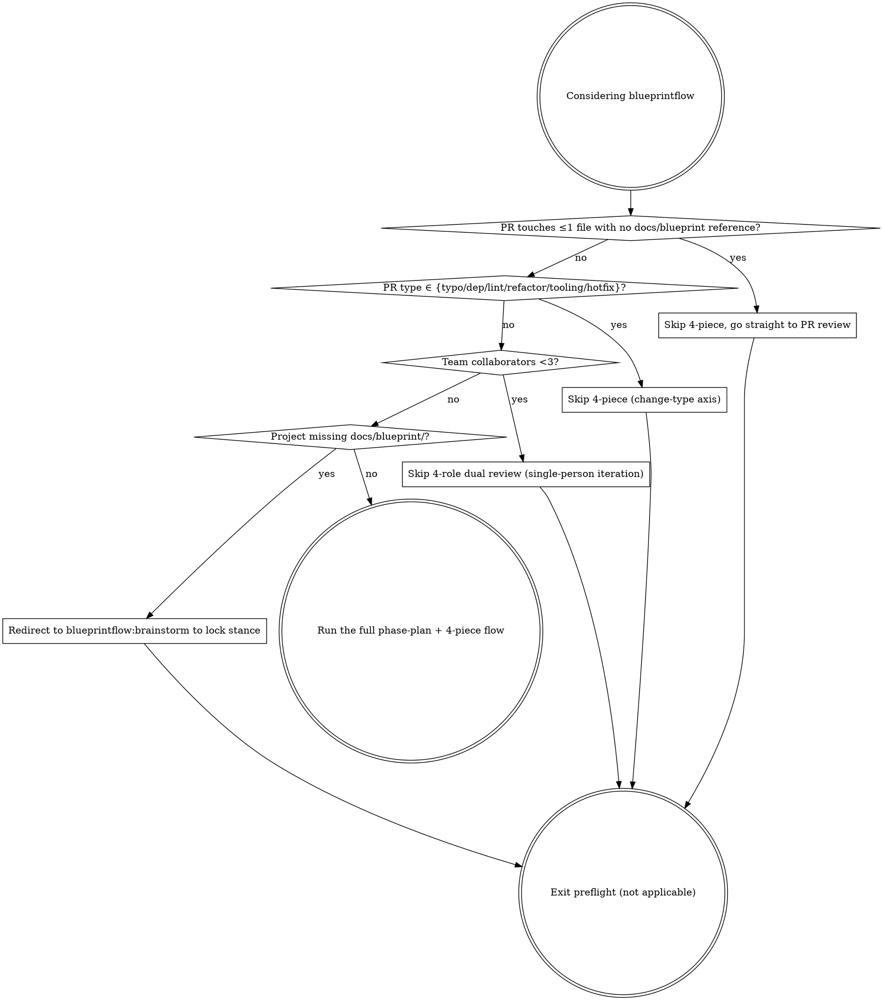

# Phase Plan

Once the blueprint is ready, the Architect leads. Break the project into a sequence of Phases, each anchored to a **value loop** (something an end user can actually use), not to technical layers.

## Preflight check

Before you reach for this heavyweight machinery, run the decision graph to check whether it actually applies. The 6 not-applicable scenarios split across two axes: a **task-size axis** (change volume / team / concept lock-in) and a **change-type axis** (typo / dep / lint / single-file refactor / tooling / hotfix). The two axes are complementary, and four diamond decision points run in series:



### The four decision points in detail

1. **Single PR touches ≤1 file with no `docs/blueprint/` reference** (task-size axis) → skip the 4-piece, go straight to PR review
   - Check: `git diff --name-only main | wc -l` ≤ 1 and `git diff main | grep -c 'docs/blueprint'` == 0
   - Reason: the 4-piece (spec / stance / acceptance / content-lock) is milestone-level overhead. A single-file fix or comment tweak doesn't need it. The single review path in `blueprintflow:pr-review-flow` is enough.
   - Constraint: if a single-file change cites a blueprint §X.Y (modifying a stance / changing a concept definition) → you can't skip; you have to run the 4-piece + 4-role review.

2. **PR type ∈ {typo / dep bump / lint patch / single-file refactor / CI tooling / hotfix}** (change-type axis) → skip the 4-piece
   - Check (skip if any one matches): typo (commit message contains `typo` / `fix typo`); dep bump (only `package.json` / `go.mod` / `Cargo.toml` + lockfile); lint patch (only `.eslintrc` / `.golangci.yml` / formatter config); single-file refactor (variable rename / extract function, no API or stance change); CI tooling (`.github/` / ruleset / cron tweaks); hotfix (`hotfix/` branch prefix + tied to a production incident).
   - Reason: these PRs are mechanical in shape (dep management / tooling / emergency fix); running spec → stance → acceptance → content-lock is empty motion. Hotfix also skips brainstorm (the emergency path can't wait for stance lock).
   - Constraint: ❌ a major-version dep bump (breaking) → fall back to the 4-piece (cross-version = changing the concept contract); ❌ a single-file refactor that crosses a blueprint §X.Y anchor → fall back; ❌ a hotfix must be followed within 7 days by a retro PR explaining the root cause (you can't permanently use hotfix to bypass).

3. **Team collaborators < 3** (task-size axis) → skip the 4-role dual review (single-person iteration scenario)
   - Check: actual active contributor count in the repo (`gh api repos/:owner/:repo/contributors | jq length`) < 3
   - Reason: the 4-piece + dual review path assumes PM / Dev / QA / Architect collaborating across multiple people. A 1- or 2-person project can't carry 4 roles; self-review is enough.
   - Constraint: an AI agent team (e.g. 1 human + 6 role agents) **doesn't count as single-person** — the agents fill the roles, run the full flow.

4. **Project is missing the `docs/blueprint/` directory** (task-size axis) → redirect to `blueprintflow:brainstorm` to lock stance, then come back
   - Check: `test -d docs/blueprint/ && ls docs/blueprint/*.md | wc -l` ≥ 1
   - Reason: phase-plan assumes "blueprint ready" (literally the first sentence of this skill). Splitting Phases without stances or a concept model = splitting an empty shell. Step back, run brainstorm + blueprint-write to lock stance, then come back.
   - Constraint: `docs/blueprint/` exists but only has a README and no concrete module docs → still counts as not-ready; run brainstorm to fill it (a lone README isn't a product-shape source of truth).

### Anti-patterns

- ❌ Skipping preflight and going straight into phase-plan: dragging heavyweight machinery onto a project that doesn't need it, slowing short-task iteration
- ❌ Forcing phase-plan after preflight returned "not applicable": once the decision graph says "not applicable", exit; don't double back
- ❌ Short-circuiting the four decision points with "or": you have to walk the graph in order (change volume → change type → team size → blueprint ready); each later condition depends on the earlier ones being confirmed
- ❌ Permanently bypassing the 4-piece via hotfix / dep bump: a retro PR is required within 7 days (consistent with constraint 2)

## When to start a new Phase vs add a wave

Phase split is a **blueprint-level** action — you split into Phases when a blueprint version freezes. After Phases are split, work that comes later belongs to one of three categories:

| Trigger | What it is | Where it lives |
|---|---|---|
| New blueprint version freezes (`blueprint-iteration`: next → current cutover) | Start a new **Phase N+1** with its own value loop + exit gate | Run the full phase-plan flow → `docs/tasks/phase-N-{name}/phase-plan.md` |
| Current blueprint's "gap-to-target" rewrite (e.g. a `§3 with current state` table that documents work still pending) | A **milestone wave** under the existing Phase | `docs/tasks/<wave-name>/phase-plan.md` (no Phase number; the wave itself names the work) |
| Ad-hoc bug / feature from a GitHub issue | A single milestone, no wave, no new Phase | `docs/tasks/<issue#>-<slug>/` |

The distinguishing question is: **did the blueprint contract itself change?** A new blueprint version means the product-shape source of truth changed — that warrants a new Phase boundary with its own exit gate. Rewriting the gap table inside an existing blueprint chapter doesn't change the contract; it just builds toward the existing target. That's a wave.

### Wave structure

A wave is just a milestone set with a shared closure gate. You don't create a new `Phase 5` row in the project's overview; you create a folder under `docs/tasks/` that holds the wave's milestones, and the closure milestone (often the most demonstrable one — a release demo, a fault-tolerance proof) carries the gate signoffs.

Wave folder layout:

```
docs/tasks/<wave-name>/
├── phase-plan.md           # the wave's milestone list + closure gate
├── <milestone-1>/          # leaf folder, normal milestone structure
├── <milestone-2>/
└── ...
```

`<wave-name>` and `phase-N-{name}` are **container folders**; the milestone subdirectories inside are **leaf folders**. See `blueprintflow-milestone-fourpiece` "Naming convention" for the leaf vs container split.

The closure milestone runs a 4-role signoff applied to the wave's specific deliverable, not to a Phase boundary. **The signoff roles are different from Phase exit**:

| Gate type | Signoff roles | Why |
|---|---|---|
| **Phase exit** (`phase-exit-gate`) | Dev + PM + QA + Teamlead | Phase boundary = blueprint-version transition; Teamlead coordinates the handoff and the project moves into the next Phase |
| **Wave closure** (closure milestone PR) | Dev + PM + QA + Security | Wave = implementation deliverable inside an existing blueprint; Security reviews the shipped code (not a Phase boundary), Dev signs off own implementation |

Wave closure is just a regular milestone PR whose scope is the wave's full deliverable. It follows the normal `blueprintflow-milestone-fourpiece` + `blueprintflow-pr-review-flow` process — no separate skill needed. The 4-role signoff above is what `pr-review-flow` already requires for any milestone PR; the wave-closure framing simply notes that this particular milestone is the wave's closure.

### Why this distinction matters

If you start a new Phase for every milestone wave, the Phase number loses its meaning (it just becomes a counter). Phases mark **blueprint-version transitions** so that dependents downstream (release notes, migration plans, quarterly reviews) can map "what was true at Phase N exit" to "what changed between Phase N and Phase N+1". A wave inside one blueprint version doesn't change what's true; it just fills in already-planned work.

Anti-patterns:

- ❌ Starting a Phase 5 for every gap-table rewrite (Phase counter inflation)
- ❌ Treating an ad-hoc bug fix as a wave (overhead — a single milestone is enough)
- ❌ Editing the `_archive`-d execution-plan.md to add a new Phase row (history is frozen; new Phases live in `docs/tasks/`)

### Numbering rules

**Phase numbers are monotonic and irreversible**:

- Phase numbers only go up. After Phase N is opened, the next Phase is N+1, never N+2 (no skipping).
- Phase exits don't roll back. If Phase N's exit gate doesn't pass, work continues inside Phase N — you don't drop back to Phase N-1.
- Phase exits don't split or merge. Trying to split Phase 1 into 1a / 1b means the work that justified the original Phase boundary was wrong; instead, use waves to organize internal subdivisions while keeping Phase 1 as one boundary. Likewise, merging Phase 1 + 2 into "Phase 1.5" is an anti-pattern.
- Phase numbers are historical markers — "Phase 1 closed = users can sign up and send messages" is a recorded fact, not a counter to increment.

**Waves use names, not numbers**:

- Inside a Phase, multiple waves may run with no required order between them. Numbering implies sequence, but waves don't need a sequence.
- Use a descriptive name as the folder ID: `helper-v1-release/`, `mobile-onboarding-rebuild/`, `eu-data-residency-rollout/`.
- Wave closure = the wave's whole folder moves to `docs/tasks/archived/<wave-name>/`.

**Anti-patterns**:

- ❌ Phase number skip (going from Phase 4 to Phase 6)
- ❌ Phase number rollback (dropping back to Phase 3 because Phase 4 didn't pass exit)
- ❌ Phase split (Phase 1a / Phase 1b)
- ❌ Phase merge (Phase 1 + 2 = Phase 1.5)
- ❌ Wave numbering (Wave-1 / Wave-2)
- ❌ Wave name collision (two folders named the same wave)

## How to split Phases

Split by **value loop**, not by technical layer:

- ❌ Wrong: Phase 1 schema / Phase 2 server / Phase 3 client (technical layers, no value)
- ✅ Right: Phase 1 identity loop / Phase 2 collaboration loop / Phase 3 second-dimension product / Phase 4+ remaining (each Phase independently demonstrable)

> **Real example (Borgee):**
> - Phase 0 foundation
> - Phase 1 identity loop — usable on signup
> - Phase 2 collaboration loop ⭐ — multi-person collaboration
> - Phase 3 second-dimension product
> - Phase 4+ remaining modules

## Exit gate design

Every Phase must have **machine-checkable** + **user-perceivable** exit conditions on dual rails:

### Strict gate (machine-checkable)
- e.g. cookie crosstalk reverse assertion / throttling unit test / lint passes

### User-perceivable gate (signoff)
- A flagship milestone runs a demo + PM signs off + key screenshot
- Cross-Phase you can't skip this (Phase 2 exit = a real human can use it + PM ✅)

### Carry-over gate (partial signoff allowed)
- Doesn't block Phase exit, but must be anchored to a Phase N+1 placeholder PR # (rule 6)
- e.g. a carry-over gate anchored to a placeholder PR # in the next Phase

## Four drift-prevention gates

Every milestone must have these four gates attached before execution:

1. **Gate 1 template self-check** (Architect): the spec brief uses the template; check it's general enough
2. **Gate 2 grep §X.Y anchor** (Architect): every milestone has a blueprint anchor
3. **Gate 3 reverse-check table** (PM + Architect): at the end of every module doc; if a stance can't be written in one sentence, drift is happening
4. **Gate 4 flagship milestone signoff + key screenshot** (PM; AI teams skip the video)

Gates 1+2 happen in the spec brief PR (`blueprintflow:milestone-fourpiece`), gate 3 in stance + acceptance, gate 4 at demo signoff (closed by `blueprintflow:phase-exit-gate`).

## Deliverables

**Path**: `docs/tasks/`

- **README.md** — cross-milestone index + Phase overview, single source of progress truth, updated on every PR / Phase gate state change
- **00-foundation/execution-plan.md** — 5 Phases + exit gates + 4 drift gates
- **00-foundation/roadmap.md** — thumbnail + first-wave demo path
- **00-foundation/how-to-write-milestone.md** — milestone template + acceptance four-choice
- **<milestone-or-issue>/** — one folder per work unit (spec / stance / content-lock / acceptance / design / progress, see `blueprintflow-milestone-fourpiece`)

## docs/tasks/README.md template

```
| Phase | Status | Exit condition | Notes |
|-------|--------|----------------|-------|
| Phase 0 foundation loop | ✅ DONE | G0.x all passed | bootstrap |
| Phase 1 identity loop | ✅ DONE | G1.x all passed | <milestone-ids> |
| Phase 2 collaboration loop ⭐ | 🔄/✅ | strict N + carry-over anchored to Phase 4 PR # | <milestone-id> ⭐ |
| Phase 3 second dimension | TODO | G3.x + PM signoff | waiting for Phase 2 |
| Phase 4+ remaining | TODO | G4.audit | waiting for Phase 3 |
```

After every PR is merged, update the corresponding milestone row ⚪→✅ immediately (via a follow-up flip PR, see `blueprintflow:pr-review-flow`).

## Anti-patterns

- ❌ Splitting Phases by technical layer (no value loop)
- ❌ Exit gates that only rely on machine checks (missing user perception)
- ❌ Carry-over gate not anchored to a Phase N+1 PR # (rule 6 requires it)
- ❌ PROGRESS.md not updated promptly (slow-cron audit will catch it and assign a fix-up)

## How to invoke

After the blueprint is ready:

```
follow skill blueprintflow-phase-plan
write PROGRESS.md + execution-plan + roadmap
```
