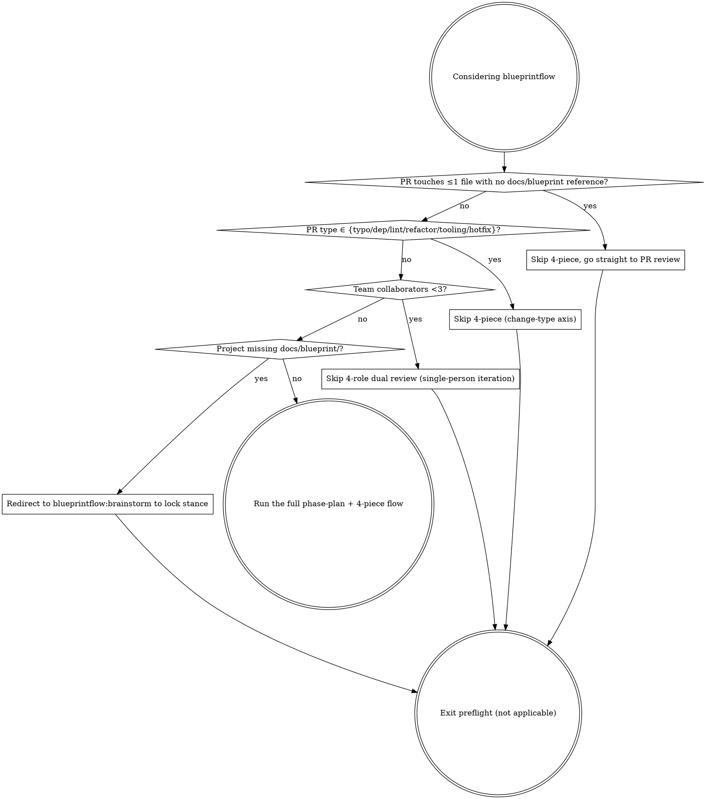

# Preflight check

Before you reach for this heavyweight machinery, run the decision graph to check whether it actually applies. The 6 not-applicable scenarios split across two axes: a **task-size axis** (change volume / team / concept lock-in) and a **change-type axis** (typo / dep / lint / single-file refactor / tooling / hotfix). The two axes are complementary, and four diamond decision points run in series:

### The four decision points in detail

1. **Single PR touches ≤1 file with no `docs/blueprint/` reference** (task-size axis) → skip the 4-piece, go straight to PR review
   - Check: `git diff --name-only main | wc -l` ≤ 1 and `git diff main | grep -c 'docs/blueprint'` == 0
   - Reason: the 4-piece (spec / stance / acceptance / content-lock) is milestone-level overhead. A single-file fix or comment tweak doesn't need it. The single review path in `blueprintflow:pr-review-flow` is enough.
   - Constraint: if a single-file change cites a blueprint §X.Y (modifying a stance / changing a concept definition) → you can't skip; you have to run the 4-piece + 4-role review.

2. **PR type ∈ {typo / dep bump / lint patch / single-file refactor / CI tooling / hotfix}** (change-type axis) → skip the 4-piece
   - Check (skip if any one matches): typo (commit message contains `typo` / `fix typo`); dep bump (only `package.json` / `go.mod` / `Cargo.toml` + lockfile); lint patch (only `.eslintrc` / `.golangci.yml` / formatter config); single-file refactor (variable rename / extract function, no API or stance change); CI tooling (`.github/` / ruleset / cron tweaks); hotfix (`hotfix/` branch prefix + tied to a production incident).
   - Reason: these PRs are mechanical in shape (dep management / tooling / emergency fix); running spec → stance → acceptance → content-lock is empty motion. Hotfix also skips brainstorm (the emergency path can't wait for stance lock).
   - Constraint: ❌ a major-version dep bump (breaking) → fall back to the 4-piece (cross-version = changing the concept contract); ❌ a single-file refactor that crosses a blueprint §X.Y anchor → fall back; ❌ a hotfix must be followed within 7 days by a retro PR explaining the root cause (you can't permanently use hotfix to bypass).

3. **Team collaborators < 3** (task-size axis) → skip the 4-role dual review (single-person iteration scenario)
   - Check: actual active contributor count in the repo (`gh api repos/:owner/:repo/contributors | jq length`) < 3
   - Reason: the 4-piece + dual review path assumes PM / Dev / QA / Architect collaborating across multiple people. A 1- or 2-person project can't carry 4 roles; self-review is enough.
   - Constraint: an AI agent team (e.g. 1 human + 6 role agents) **doesn't count as single-person** — the agents fill the roles, run the full flow.

4. **Project is missing the `docs/blueprint/` directory** (task-size axis) → redirect to `blueprintflow:brainstorm` to lock stance, then come back
   - Check: `test -d docs/blueprint/ && ls docs/blueprint/*.md | wc -l` ≥ 1
   - Reason: phase-plan assumes "blueprint ready" (literally the first sentence of this skill). Splitting Phases without stances or a concept model = splitting an empty shell. Step back, run brainstorm + blueprint-write to lock stance, then come back.
   - Constraint: `docs/blueprint/` exists but only has a README and no concrete module docs → still counts as not-ready; run brainstorm to fill it (a lone README isn't a product-shape source of truth).

### Anti-patterns

- ❌ Skipping preflight and going straight into phase-plan: dragging heavyweight machinery onto a project that doesn't need it, slowing short-task iteration
- ❌ Forcing phase-plan after preflight returned "not applicable": once the decision graph says "not applicable", exit; don't double back
- ❌ Short-circuiting the four decision points with "or": you have to walk the graph in order (change volume → change type → team size → blueprint ready); each later condition depends on the earlier ones being confirmed
- ❌ Permanently bypassing the 4-piece via hotfix / dep bump: a retro PR is required within 7 days (consistent with constraint 2)
